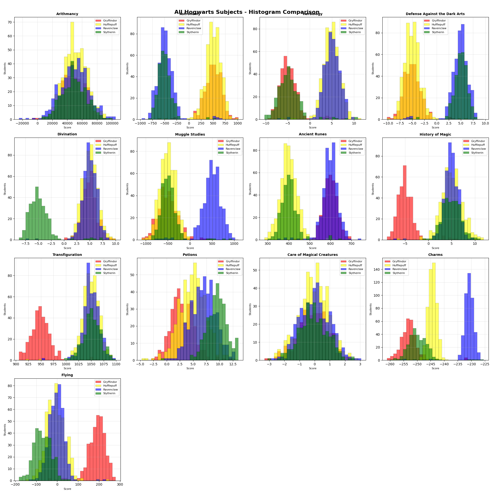
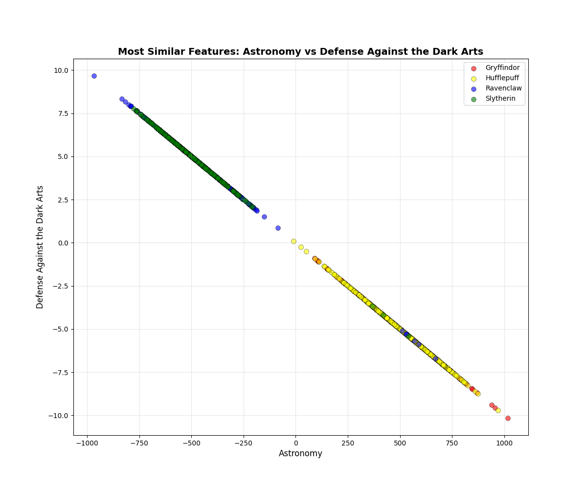
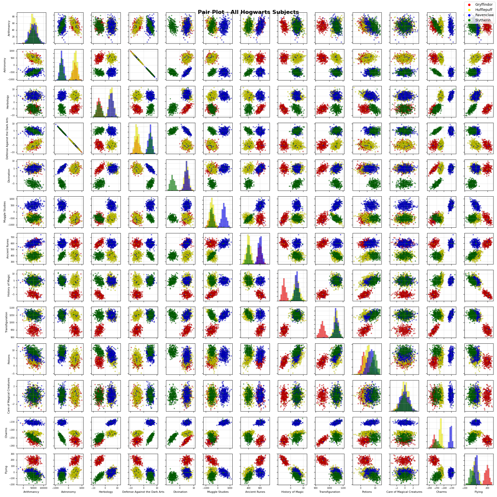

# DSLR - Data Science × Logistic Regression

> *Harry Potter and the Data Scientist*

Implement logistic regression from scratch to sort Hogwarts students into their houses.

**Goal**: Multi-class classifier using **one-vs-all logistic regression** with **gradient descent** to achieve ≥98% accuracy.

**Constraints**:
- ❌ Forbidden: mean, std, min, max, percentile, describe, etc.
- ❌ No sklearn for training (only accuracy_score for evaluation)
- ✅ Implement everything manually

**Dataset**: 1600 students (training), 400 students (test), 13 course features, 4 houses

---

## Table of Contents

- [Part 1: Data Analysis](#part-1-data-analysis)
- [Part 2: Data Visualization](#part-2-data-visualization)
- [Part 3: Logistic Regression](#part-3-logistic-regression)
- [Usage](#usage)

---

## Part 1: Data Analysis

### `describe.py`

Display statistical information for all numerical features (like pandas `describe()`).

**Implemented Statistics**:

**Basic** (mandatory):
- **Count**: Number of non-null values
- **Mean**: `mean = (Σ xi) / n`
- **Std**: `std = √[Σ(xi - mean)² / (n-1)]` ← Bessel's correction (n-1)
- **Min/Max**: Minimum and maximum values
- **Percentiles** (25%, 50%, 75%): Uses linear interpolation for non-integer positions

**Bonus**:
- Range, IQR, Variance, Skewness, Kurtosis, MAD, Outliers

---

## Part 2: Data Visualization

### Histogram Analysis

**Question**: *Which Hogwarts course has a homogeneous score distribution between all four houses?*



**Answer: Care of Magical Creatures**

**Why?**
- All four house histograms overlap significantly
- Distribution shapes are nearly identical across houses
- No house shows a distinctly different pattern
- → Not useful for classification (all houses look the same)

**Key observations**:
- **Astronomy**: Excellent separation with distinct peaks per house ✅
- **Charms**: Good separation, especially Hufflepuff ✅
- **Arithmancy**: High overlap, poor discriminator ❌

---

### Scatter Plot Analysis

**Question**: *What are the two features that are similar?*

**Pearson Correlation Formula**:
```
r = Σ[(xi - x̄)(yi - ȳ)] / √[Σ(xi - x̄)² × Σ(yi - ȳ)²]

where r ∈ [-1, 1]:
  r = 1  → perfect positive correlation
  r = -1 → perfect negative correlation
  r = 0  → no correlation
```



**Answer: Astronomy and Defense Against the Dark Arts (r ≈ 0.99)**

**Why it matters**:
- Points form a clear diagonal line → nearly perfect linear relationship
- **Multicollinearity problem**: Using both features makes the model unstable
- **Decision**: Keep only ONE (Astronomy OR Defense Against the Dark Arts)

---

### Pair Plot Analysis

**Question**: *From this visualization, which features are you going to use for your logistic regression?*



**Analysis method**:
- **Diagonal**: Histograms (distribution per house)
- **Off-diagonal**: Scatter plots (relationships between features)
- **Criteria**: Class separation quality + avoid redundancy

#### Feature-by-Feature Decision

| Feature | Quality | Decision | Reason |
|---------|---------|----------|--------|
| **Astronomy** | ⭐⭐⭐⭐⭐ | ✅ KEEP | Excellent separation, distinct clusters |
| **Herbology** | ⭐⭐⭐⭐⭐ | ✅ KEEP | Excellent separation |
| **Ancient Runes** | ⭐⭐⭐⭐ | ✅ KEEP | Very good horizontal separation |
| **Divination** | ⭐⭐⭐⭐ | ✅ KEEP | Clear clusters |
| **Charms** | ⭐⭐⭐ | ✅ KEEP | Hufflepuff well separated |
| **Flying** | ⭐⭐⭐ | ✅ KEEP | Gryffindor distinct |
| **Defense Against the Dark Arts** | ⭐⭐⭐⭐ | ❌ REMOVE | Correlated with Astronomy (r ≈ 0.99) |
| **Care of Magical Creatures** | ⭐⭐ | ❌ REMOVE | Homogeneous (from histogram) |
| **Arithmancy** | ⭐ | ❌ REMOVE | Complete mixing, no power |
| **Others** (Transfig, Muggle, Potions) | ⭐⭐ | ❌ REMOVE | Too much overlap |

#### Final Selection: 6 Features

```
✅ Astronomy        (excellent separator)
✅ Herbology        (excellent separator)
✅ Ancient Runes    (very good separator)
✅ Divination       (very good separator)
✅ Charms           (good separator)
✅ Flying           (good separator, complements others)
```

**Why this works**:
- Each house has a unique "signature" across these 6 features
- No redundant features
- Expected performance: >98% accuracy

---

## Part 3: Logistic Regression

### Overview

**Strategy**: One-vs-All (train 4 binary classifiers, one per house)

```
1600 students × 6 features → Train 4 classifiers → Predict house (argmax probability)
```

---

### Step 1: Preprocessing

#### Normalization (Z-Score)

**Why?** Features have different scales (Astronomy ~500, Herbology ~1). Without normalization, gradient descent is slow.

**Formula**:
```
x_norm = (x - μ) / σ
```

**Example** (real values from logreg_model.json):

Astronomy: μ = 39.47, σ = 521.50
```
Score 600  → x_norm = (600 - 39.47) / 521.50 = 1.075
Score -200 → x_norm = (-200 - 39.47) / 521.50 = -0.459
```

Result: All features have **mean=0, std=1** → fast convergence ✅

#### Bias Term

Add column of 1s:
```
Original:  [x₁, x₂, x₃, x₄, x₅, x₆]
With bias: [1, x₁, x₂, x₃, x₄, x₅, x₆]  ← 7 values
```

Purpose: Allows decision boundary to shift (not forced through origin)

---

### Step 2: One-vs-All Strategy

Train **4 separate binary classifiers**:

| Classifier | Question | Labels |
|------------|----------|--------|
| θ_Gryffindor | "Is Gryffindor?" | Gryff=1, Others=0 |
| θ_Hufflepuff | "Is Hufflepuff?" | Huff=1, Others=0 |
| θ_Ravenclaw | "Is Ravenclaw?" | Rav=1, Others=0 |
| θ_Slytherin | "Is Slytherin?" | Sly=1, Others=0 |

Each learns **θ** with 7 weights (1 bias + 6 features)

---

### Step 3: Core Math

#### Sigmoid Function

**Formula**: `g(z) = 1 / (1 + e^(-z))`

**Purpose**: Convert any number to probability [0, 1]

**Examples**:
```
z = 0   → 0.5    (50%)
z = 2   → 0.88   (88%)
z = -2  → 0.12   (12%)
z = 5   → 0.993  (99%)
```

#### Hypothesis Function

**Formula**: `h(x) = sigmoid(θᵀ · x)`

**Example** (real trained weights):

Gryffindor θ = [-3.39, 1.27, -1.27, -2.23, 2.67]
Student x = [1, 0.5, -0.3, 1.2, 0.8]

```
z = θᵀ·x = (-3.39×1) + (1.27×0.5) + (-1.27×-0.3) + (-2.23×1.2) + (2.67×0.8)
z = -3.39 + 0.635 + 0.381 - 2.676 + 2.136 = -2.914

h(x) = 1/(1 + e^2.914) ≈ 0.05  →  5% Gryffindor
```

#### Cost Function (Binary Cross-Entropy)

**Formula**:
```
J(θ) = -(1/m) × Σ[y·log(h(x)) + (1-y)·log(1-h(x))]
```

where m=1600, y=label (0/1), h(x)=predicted probability

**Example** (3 students):

| Student | y | h(x) | Cost |
|---------|---|------|------|
| Harry | 1 | 0.95 | -log(0.95) = 0.051 |
| Hermione | 1 | 0.70 | -log(0.70) = 0.357 |
| Draco | 0 | 0.05 | -log(0.95) = 0.051 |

```
J(θ) = -(1/3) × [0.051 + 0.357 + 0.051] = 0.153
```

**Interpretation**: Lower cost = better model, J(θ)=0 = perfect

**Why log?** Penalizes confident wrong predictions heavily

---

### Step 4: Gradient Descent

#### Gradient

**Formula**: `∇J(θ) = (1/m) × Xᵀ · (h - y)`

where:
- X = feature matrix (1600 × 7)
- h = predictions, y = labels

#### Update Rule

**Formula**: `θ := θ - α × ∇J(θ)`

where α = learning rate (0.1)

**Example** (1 weight):

```
Iter 0:    θ=0, J=0.693, ∇J=0.25  → θ_new = 0 - 0.1×0.25 = -0.025
Iter 1:    θ=-0.025, J=0.680      → θ_new = -0.048
...
Iter 1000: θ=-3.39, J=0.020       → converged ✓
```

#### Early Stopping

Stop when: `|J_previous - J_current| < 1e-6`

```
Iter 0:    Cost = 0.6931
Iter 100:  Cost = 0.2451
Iter 500:  Cost = 0.0453
Iter 1200: Cost = 0.0201
Iter 1201: Cost = 0.0201  ← converged!
```

---

### Step 5: Making Predictions (logreg_predict.py)

#### 5.1 Loading the Model

The trained model is saved in JSON format with explicit feature-weight mapping:

```json
{
    "weights": {
        "Gryffindor": {
            "bias": -3.391,
            "Astronomy": 1.272,
            "Defense Against the Dark Arts": -1.272,
            "Herbology": -2.231,
            "Ancient Runes": 2.671
        },
        ...
    },
    "normalization_params": {
        "Astronomy": {"mean": 39.47, "std": 521.50},
        ...
    }
}
```

**Why this format?** Explicit feature names eliminate any risk of mixing up feature order between training and prediction.

#### 5.2 Preprocessing Test Data

**Step 1: Normalize features**

For each feature, apply z-score normalization using **training set** statistics (μ and σ from model):

```python
x_norm = (x - μ_train) / σ_train
```

**Important**: Never compute new statistics on test data - always use training set parameters!

**Step 2: Handle missing values**

Test dataset has NaN values. Strategy:

```python
# After normalization, replace NaN with 0
X = X.fillna(0)
```

**Why 0?** In normalized data:
- mean = 0, std = 1
- Setting NaN to 0 means "assume average value for this student"
- More neutral than dropping rows (which would give <400 predictions)

**Step 3: Add bias term**

```python
X.insert(0, 'bias', 1)
```

Result: `[1, x_astronomy, x_defense, x_herbology, x_runes]`

#### 5.3 Computing Probabilities

For **each student**, compute probability for **each house**:

**Real example** (student from test set):

Normalized features: `x = [1, 0.5, -0.3, 1.2, 0.8]` (bias + 4 features)

**Gryffindor**:
```
z = θᵀ·x = (-3.391×1) + (1.272×0.5) + (-1.272×-0.3) + (-2.231×1.2) + (2.671×0.8)
z = -3.391 + 0.636 + 0.382 - 2.677 + 2.137 = -2.913

P(Gryffindor) = sigmoid(-2.913) = 1/(1 + e^2.913) = 0.051  →  5%
```

**Hufflepuff**:
```
z = (θ_huff)ᵀ·x = ... (same calculation with Hufflepuff weights)
P(Hufflepuff) = sigmoid(z) = 0.823  →  82%
```

**Ravenclaw**: `P(Ravenclaw) = 0.095` → 10%
**Slytherin**: `P(Slytherin) = 0.031` → 3%

#### 5.4 Choosing the House (argmax)

**Manual argmax implementation** (max() is forbidden):

```python
def get_best_house(probabilities: dict) -> str:
    max_house = None
    max_proba = -float('inf')

    for house, proba in probabilities.items():
        if proba > max_proba:
            max_proba = proba
            max_house = house

    return max_house
```

**Result**: `max([0.051, 0.823, 0.095, 0.031])` = **Hufflepuff** ✅

#### 5.5 Output Format

Generate `houses.csv` with **exact format** required by subject:

```csv
Index,Hogwarts House
0,Gryffindor
1,Hufflepuff
2,Ravenclaw
3,Hufflepuff
...
399,Slytherin
```

**Critical**: Must have exactly 400 predictions with this format, or evaluation script will fail.

#### 5.6 Results

**Achieved accuracy: 99%** 🎉

```bash
$ python evaluate.py
Your score on test set: 0.99
```

Performance exceeds minimum requirement (98%) ✅

---

## Formula Summary

| Concept | Formula | Purpose |
|---------|---------|---------|
| **Normalization** | `(x - μ) / σ` | Scale features |
| **Sigmoid** | `1 / (1 + e^(-z))` | → probability [0,1] |
| **Hypothesis** | `h(x) = sigmoid(θᵀx)` | Predict probability |
| **Cost** | `J(θ) = -(1/m)Σ[y·log(h) + (1-y)·log(1-h)]` | Measure error |
| **Gradient** | `∇J = (1/m)Xᵀ(h - y)` | Update direction |
| **Update** | `θ := θ - α·∇J` | Improve weights |
| **One-vs-All** | 4 binary classifiers | Handle 4 classes |
| **Argmax** | Loop to find max probability | Choose house |
| **NaN Handling** | `fillna(0)` after normalization | Assume average value |

---

## Usage

```bash
# Part 1: Data Analysis
python src/data/describe.py datasets/dataset_train.csv

# Part 2: Visualization
python src/data/histogram.py
python src/data/scatter_plot.py
python src/data/pair_plot.py

# Part 3: Training & Prediction
python src/logistic_regression/logreg_train.py datasets/dataset_train.csv
python src/logistic_regression/logreg_predict.py datasets/dataset_test.csv logreg_model.json

# Evaluation
python evaluate.py
```
